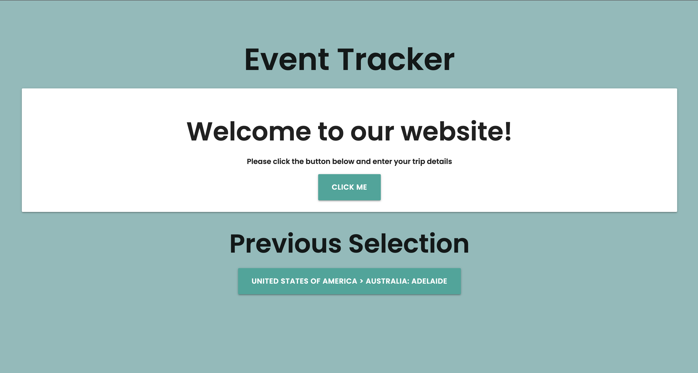
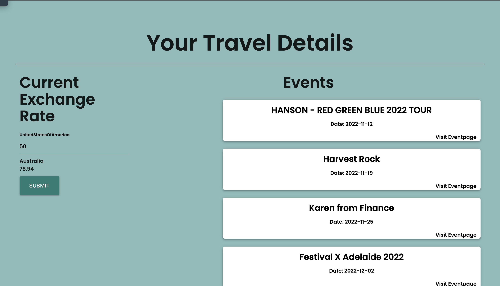

# Event Tracker

## Description

This project challenged us to make an interactive and responsive website using several server-side APIs. Our website fulfills those requirements in the from of a world-wide event tracker.

Our website allows the user to input a country and city throughout the world and will be presented with a list of events that are occurring in the future. Our website also features a currency exchanger which will automatically update with the currencies from which the user inputs.

The website also stores your previous selections into the local storage so they can be easily accessed without having to input everything again.

## User Story
```md
AS a regular traveler
I WANT to plan a trip overseas
SO THAT I can determine the best flight options and the optimal time to exchange currency.
```
## Acceptance Criteria
```md
- Use a CSS framework other than Bootstrap.
- Be interactive (in other words, accept and respond to user input).
- Use at least two server-side APIs
- Use modals instead of alerts, confirms, or prompts.
- Use client-side storage to store persistent data.
- Be responsive
- Have a polished UI.
- Be deployed to GitHub Pages.
- Have a clean repository that meets quality coding standards (file - structure, naming conventions, best practices for class/id naming conventions, indentation, quality comments, and so on).
- Have a quality README (including a unique name, description, technologies used, screenshot, and link to the deployed application)
```

## Built With

* HTML
* CSS
    * Materialize (CSS Framework)
* JavaScript
* Server-Side APIs
    * [TicketMaster API](https://developer.ticketmaster.com/products-and-docs/apis/discovery-api/v2/#search-attractions-v2)
    * [Exchange Rate API](https://www.exchangerate-api.com/)

## Usage 

To access this website, follow the link below and you will be redirected. Click the button and input your selections. After being redirected, you will see a list of events with an external link which will show you more information about the event. You can also input an amount in the currency exchange section and be returned with the amount exchange into another currency.

Below is the link to the webpage

https://jasminshea.github.io/PlanTravel/




## Credits

Made by
* [Brodie Marshall](https://github.com/brodie02)
* [Jasmin Shearer](https://github.com/jasminshea)
* [Ryan Zadeh](https://github.com/RyanZade)

